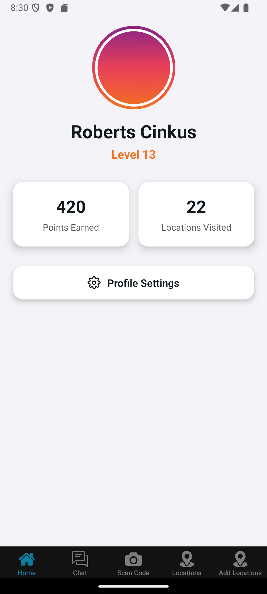

# Visitation Tracking App By Roberts Cinkus

## Description

The Visitation Tracking App allows users to scan QR codes of various locations. Once a QR code is scanned, the app compares the user's current location with the stored location in the database. If the user's location matches, they will earn points. Firebase Authentication is integrated into the app to manage user sign-up, login, and authentication.

## Features
- **QR Code Scanning**: Users can scan QR codes to check-in at different locations.
- **Location Verification**: The app compares the user's current location with the database to validate if they are at the right location.
- **Points System**: Users earn points for successfully visiting and verifying locations.
- **User Authentication**: Firebase Authentication is used for secure user login and registration.

## Technologies Used
- **React Native**: The framework for building the app.
- **Expo**: For easy development and testing.
- **Firebase**: For user authentication and real-time database management.
- **React Navigation**: To manage app navigation.

## Setup

### 1. Clone the repository:
```bash
git clone https://github.com/MrCactuss/Projekt.git
cd Projekt
```

## Get started

1. Install dependencies

   ```bash
   npm install
   ```

2. Start the app

   ```bash
    npx expo start
   ```

## Screenshots

<table>
     <tr>
          <td>
               
          </td>
          <td>
               
          </td>
           <td>
               
          </td>
           <td>
               
          </td>
           <td>
               
          </td>
     </tr>
     <tr>
         <td align="center">Login Screen</td> 
         <td align="center">User Screen</td>
         <td align="center">QR Code Creation Screen</td>
         <td align="center">Locations Screen</td>
         <td align="center">Camera Screen</td>
     </tr>
</table>

## Test User

1. username- cinkusr@inbox.lv
2. password- testing
